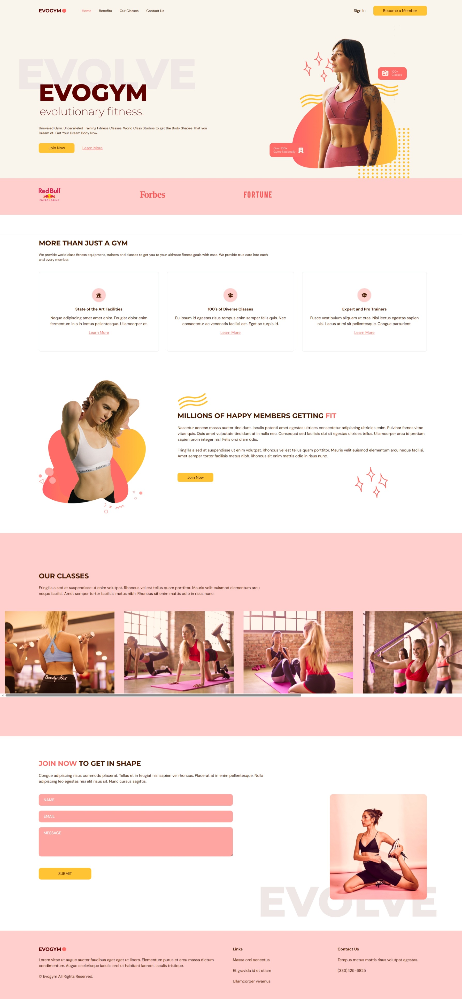

# evogym



## Tech Stack

1. **React.js**: For building dynamic and interactive user interfaces.
2. **Tailwind CSS**: For utility-first, responsive, and modern styling.
3. **TypeScript**: For adding static typing to JavaScript and more.
4. **HTML5 & JSX**: For structuring UI components in a declarative way.

## Usage

Clone it :

```
$ git clone https://github.com/Dibyaranjan450/evogym.git
```

Visit the page at :

```
https://evogym-dibya-nayaks-projects.vercel.app
```

## Contributor

- Creator of evogym [@Dibyaranjan450](https://github.com/Dibyaranjan450)
